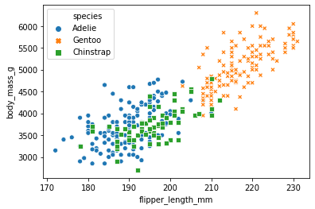

[https://github.com/allisonhorst/palmerpenguins Palmer Penguins example](https://github.com/allisonhorst/palmerpenguins) ported to Python.


```python
import pandas
import seaborn

penguins = pandas.read_csv(
    'https://raw.githubusercontent.com/JohnMount/Penguins/main/penguins.csv')
penguins_raw = pandas.read_csv(
    'https://raw.githubusercontent.com/JohnMount/Penguins/main/penguins_raw.csv')


print(penguins.shape)
penguins.head()
```

    (344, 7)


<div>
<table border="1" class="dataframe">
  <thead>
    <tr style="text-align: right;">
      <th></th>
      <th>species</th>
      <th>island</th>
      <th>bill_length_mm</th>
      <th>bill_depth_mm</th>
      <th>flipper_length_mm</th>
      <th>body_mass_g</th>
      <th>sex</th>
    </tr>
  </thead>
  <tbody>
    <tr>
      <th>0</th>
      <td>Adelie</td>
      <td>Torgersen</td>
      <td>39.1</td>
      <td>18.7</td>
      <td>181.0</td>
      <td>3750.0</td>
      <td>male</td>
    </tr>
    <tr>
      <th>1</th>
      <td>Adelie</td>
      <td>Torgersen</td>
      <td>39.5</td>
      <td>17.4</td>
      <td>186.0</td>
      <td>3800.0</td>
      <td>female</td>
    </tr>
    <tr>
      <th>2</th>
      <td>Adelie</td>
      <td>Torgersen</td>
      <td>40.3</td>
      <td>18.0</td>
      <td>195.0</td>
      <td>3250.0</td>
      <td>female</td>
    </tr>
    <tr>
      <th>3</th>
      <td>Adelie</td>
      <td>Torgersen</td>
      <td>NaN</td>
      <td>NaN</td>
      <td>NaN</td>
      <td>NaN</td>
      <td>NaN</td>
    </tr>
    <tr>
      <th>4</th>
      <td>Adelie</td>
      <td>Torgersen</td>
      <td>36.7</td>
      <td>19.3</td>
      <td>193.0</td>
      <td>3450.0</td>
      <td>female</td>
    </tr>
  </tbody>
</table>
</div>


```python
seaborn.scatterplot(
    x="flipper_length_mm", 
    y="body_mass_g",
    hue="species", 
    style="species", data=penguins)

```


    <matplotlib.axes._subplots.AxesSubplot at 0x7fa953d22990>





Palmer Penguins data from:

  [https://github.com/allisonhorst/palmerpenguins](https://github.com/allisonhorst/palmerpenguins)

>citation("palmerpenguins")
>
> To cite palmerpenguins in publications use:
>
>   Gorman KB, Williams TD, Fraser WR (2014) Ecological Sexual Dimorphism
>   and Environmental Variability within a Community of Antarctic
>   Penguins (Genus Pygoscelis). PLoS ONE 9(3): e90081.
>   https://doi.org/10.1371/journal.pone.0090081
>
> A BibTeX entry for LaTeX users is
>
>   @Article{,
>     title = {Ecological Sexual Dimorphism and Environmental Variability within a Community of Antarctic Penguins (Genus Pygoscelis)},
>     author = {Gorman KB and Williams TD and Fraser WR},
>     journal = {PLoS ONE},
>     year = {2014},
>     volume = {9(3)},
>     number = {e90081},
>     pages = {-13},
>     url = {https://doi.org/10.1371/journal.pone.0090081},
>   }


Saved using `R`:

    # install.packages("remotes")
    remotes::install_github("allisonhorst/palmerpenguins")
    write.csv(penguins, 'penguins.csv', row.names = FALSE, quote = FALSE)
    write.csv(penguins_raw, 'penguins_raw.csv', row.names = FALSE, quote = TRUE)

Exported so Python users can also use this data (original package doesn't seem to currently export a csv).


This page found here: [https://github.com/JohnMount/Penguins](https://github.com/JohnMount/Penguins)

Python example here: [https://github.com/JohnMount/Penguins/blob/main/Penguins.ipynb](https://github.com/JohnMount/Penguins/blob/main/Penguins.ipynb)

R example here: [https://github.com/JohnMount/Penguins/blob/main/Rexample.md](https://github.com/JohnMount/Penguins/blob/main/Rexample.md)

